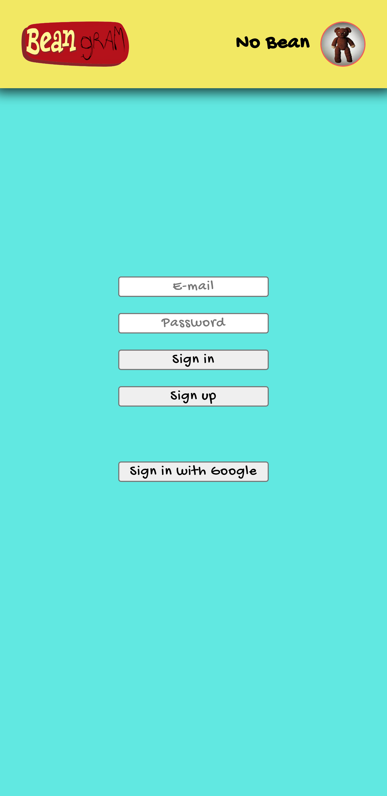

[![Contributors][contributors-shield]][contributors-url]
[![Forks][forks-shield]][forks-url]
[![Stargazers][stars-shield]][stars-url]
[![Issues][issues-shield]][issues-url]
[![MIT License][license-shield]][license-url]
[![LinkedIn][linkedin-shield]][linkedin-url]

<!-- PROJECT LOGO -->
 

  

<h3 align="center">Bean gram</h3>

  

    project_description
     
    <a href="https://github.com/sirjamo1/bean-gram"><strong>Explore the docs »</strong></a>
     
     
    <a href="http://sirjamo1.github.io/bean-gram">View Demo</a>
    ·
    <a href="https://github.com/sirjamo1/bean-gram/issues">Report Bug</a>
    ·
    <a href="https://github.com/sirjamo1/bean-gram/issues">Request Feature</a>
  

<!-- TABLE OF CONTENTS -->

  
Table of Contents

  <ol>
    <li>
      <a href="#about-the-project">About The Project</a>
      <ul>
        <li><a href="#built-with">Built With</a></li>
      </ul>
    </li>
    <li><a href="#contact">Contact</a></li>
  </ol>

<!-- ABOUT THE PROJECT -->

## About The Project

Bean gram was built for The Odin Project

Features :

<ul>
   <li>User can sign in / create account with email and password or can sign in with google.</li>
   <li>Change user profile picture and name</li>
   <li>Upload picture with description</li>
   <li>Comment on images</li>
   <li>Like images</li>
   <li>Fully responsive</li>
</ul>

   
  
   
   

   
   
   
   

<h4>Assignment :</h4>

Replicate your favorite website as close as possible - Pinterest, Facebook, Twitter, etc. Just make sure it has lots of interesting functionality. You’ll be integrating a full array of skills into this one. If you have completed a backend course, you may use that for this project, otherwise use Firebase. This should prove that you now have all the tools and knowledge needed to build a website, just like the ones you use every day.

Of course, you can’t replicate every feature, and the user interface will probably be a bit clunkier. However, if you can get yourself 80% of the way there, that’s darn impressive!

<ol>
   <li>Set up a GitHub Repo for this project. Follow the instructions in Git basics if you need help.</li>
   <li>Think about what you need to do. It’s really helpful to write your plan down on paper or whiteboard ahead of time! A few hours of thought now will save you days of coding. Try to lay it ALL out. An important part of planning is scope. You obviously can’t build the entire website (which presumably took a full team of engineers years to produce), so you’ll need to identify the site’s core functionality and the “nice-to-have” stuff. Make sure you finish the core functionality BEFORE working on the rest. If you try to do everything at once, you’ll get lost and frustrated. Trust us. Everything takes longer than you expect.</li>
   <li>Roll up your sleeves and start building!</li>
   <li>Try to test the high-level functionality using a suitable testing library, for example, Javascript with Jest or Rails with RSpec. Don’t get too bogged down in testing, but try and save yourself time by adding high-level tests, so you don’t need to click around 100 times every time you make a change to something that seems important.</li>
   <li>Once you finish, push to GitHub and definitely submit your project below!</li>
</ol>

(<a href="#readme-top">back to top</a>)

### Built With

-   [![React][react.js]][react-url]
-   FireBase

(<a href="#readme-top">back to top</a>)

<!-- USAGE EXAMPLES -->

## Usage

For Mr Bean and Teddy (and anyone else with auth) to post pictures and to comment and like them also.

(<a href="#readme-top">back to top</a>)

<!-- CONTACT -->

## Contact

James Howells - jam_how@hotmail.com

Project Link: [https://github.com/sirjamo1/bean-gram](https://github.com/sirjamo1/bean-gram)

(<a href="#readme-top">back to top</a>)

<!-- MARKDOWN LINKS & IMAGES -->
<!-- https://www.markdownguide.org/basic-syntax/#reference-style-links -->

[contributors-shield]: https://img.shields.io/github/contributors/sirjamo1/bean-gram.svg?style=for-the-badge
[contributors-url]: https://github.com/sirjamo1/bean-gram/graphs/contributors
[forks-shield]: https://img.shields.io/github/forks/sirjamo1/bean-gram.svg?style=for-the-badge
[forks-url]: https://github.com/sirjamo1/bean-gram/network/members
[stars-shield]: https://img.shields.io/github/stars/sirjamo1/bean-gram.svg?style=for-the-badge
[stars-url]: https://github.com/sirjamo1/bean-gram/stargazers
[issues-shield]: https://img.shields.io/github/issues/sirjamo1/bean-gram.svg?style=for-the-badge
[issues-url]: https://github.com/sirjamo1/bean-gram/issues
[license-shield]: https://img.shields.io/github/license/sirjamo1/bean-gram.svg?style=for-the-badge
[license-url]: https://github.com/sirjamo1/bean-gram/blob/master/LICENSE.txt
[linkedin-shield]: https://img.shields.io/badge/-LinkedIn-black.svg?style=for-the-badge&logo=linkedin&colorB=555
[linkedin-url]: https://linkedin.com/in/linkedin_username
[product-screenshot]: images/screenshot.png
[next.js]: https://img.shields.io/badge/next.js-000000?style=for-the-badge&logo=nextdotjs&logoColor=white
[next-url]: https://nextjs.org/
[react.js]: https://img.shields.io/badge/React-20232A?style=for-the-badge&logo=react&logoColor=61DAFB
[react-url]: https://reactjs.org/
[vue.js]: https://img.shields.io/badge/Vue.js-35495E?style=for-the-badge&logo=vuedotjs&logoColor=4FC08D
[vue-url]: https://vuejs.org/
[angular.io]: https://img.shields.io/badge/Angular-DD0031?style=for-the-badge&logo=angular&logoColor=white
[angular-url]: https://angular.io/
[svelte.dev]: https://img.shields.io/badge/Svelte-4A4A55?style=for-the-badge&logo=svelte&logoColor=FF3E00
[svelte-url]: https://svelte.dev/
[laravel.com]: https://img.shields.io/badge/Laravel-FF2D20?style=for-the-badge&logo=laravel&logoColor=white
[laravel-url]: https://laravel.com
[bootstrap.com]: https://img.shields.io/badge/Bootstrap-563D7C?style=for-the-badge&logo=bootstrap&logoColor=white
[bootstrap-url]: https://getbootstrap.com
[jquery.com]: https://img.shields.io/badge/jQuery-0769AD?style=for-the-badge&logo=jquery&logoColor=white
[jquery-url]: https://jquery.com
